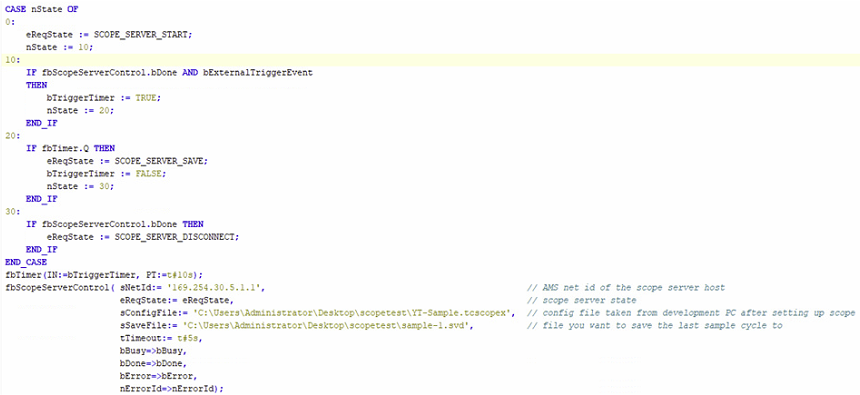

## Walkthrough of the initial scope configuration for an application using the Scope Server on a headless IPC. Secondary walkthrough of how to programatically use the export tool to create a CSV file from your recorded data. 

Manually copy over the scope configuration file from your development PC once you are satisfied with the variable mappings, settings, etc. The configuration file will be in the solution folder of your TwinCAT project. 

Copy it over to your scope server IPC, put it in a known location because you will have to specify the path in the PLC later on.

In your PLC project; add the Tc2_Utilities library if you have already not. We will use the FB_ScopeServerControl function block to control the scope from the PLC, you can map input arguments to your HMI if you want to modify the file names and when to start/stop the sample. 

https://infosys.beckhoff.com/english.php?content=../content/1033/tcplclib_tc2_utilities/35059339.html&id=

You are responsible for setting up the paths and handling the state machine with the done bits, but this will allow you to control the scope like you would from TwinCAT Scope in the XAE. One of the inputs is the path and file name of where you want the data to be saved, again put this somewhere known as it will be referenced by the next step which is exporting all of this to CSV.

Now that you have your .SVD file saved, you can export it using the NT_StartProcess function block we talked about last week – this will run the Export Tool silently in the background and create a CSV in the specified target path. 

